{}

## Download and install Java

The first step is to download a JDK (Java Development Kit). You can search for "Java JDK download"
or [click this link](https://www.oracle.com/java/technologies/downloads/) to download Java.

Download the package for your operating system. For me, I am running windows so I will download the
x64 Installer for my pc.

Running the installer.
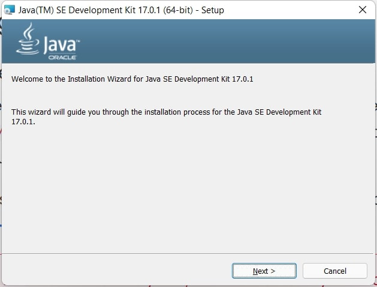
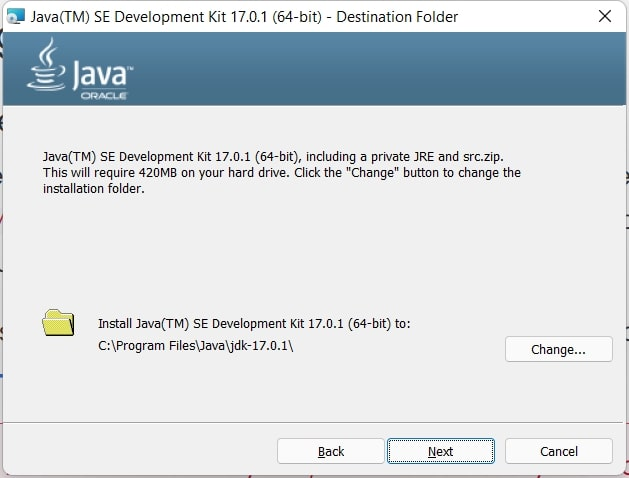

> Note: Now Eclipse provide JRE installation while installting the IDE, so downloading JDK from oracle
> is not necessery. But, for backward compability, we are going to use oracle provided JDK.

## Download and install Eclipse

We need an IDE (Integrated Development Environment aka code editor) to write our first Java program.
We will use Eclipse IDE. You can download the software [from here](https://www.eclipse.org/downloads/).

After download, install the software.

Selecet Eclipse IDE for Jada Developers.
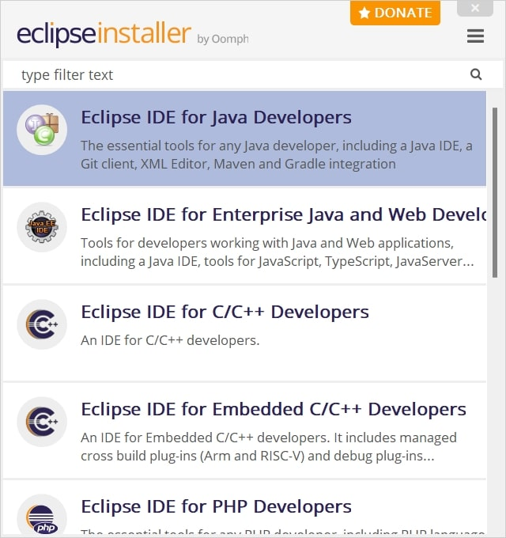

As we installed JDK earlier, Eclipse will automatically pick out installed JDK.
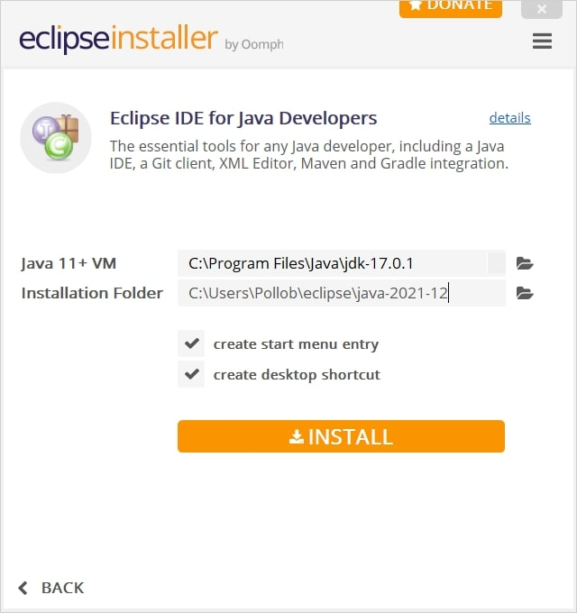

However, if you wish you can pick up other JRE provided by Eclipse.
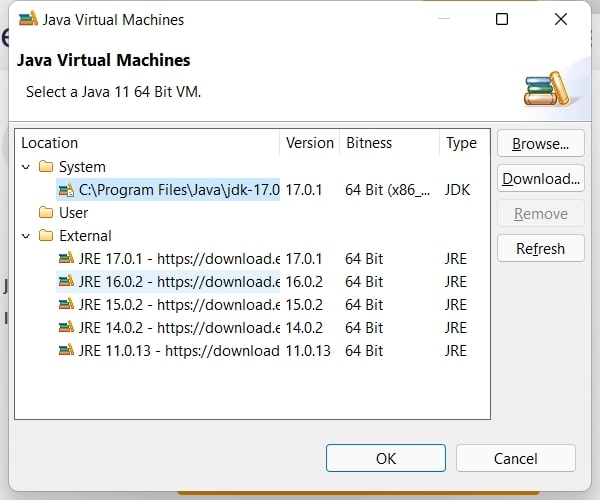

Continue installation by Accepting terms and conditions.
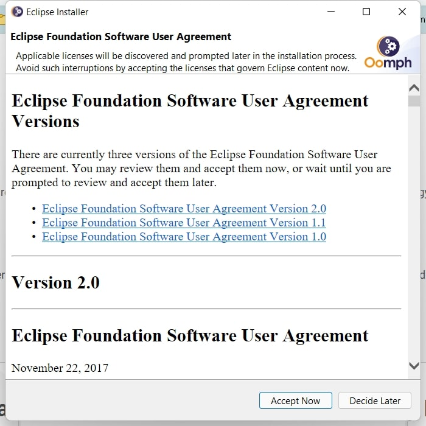

You can change the default directory for new projects.
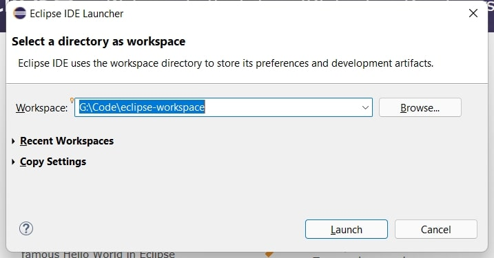

## Create and run a new project
Open Eclipse by searching on windows.
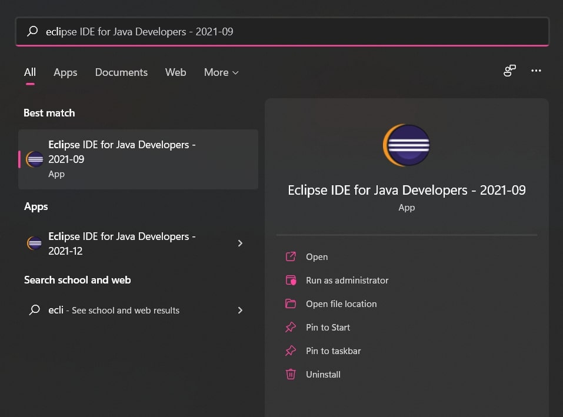

Create a new Java project.
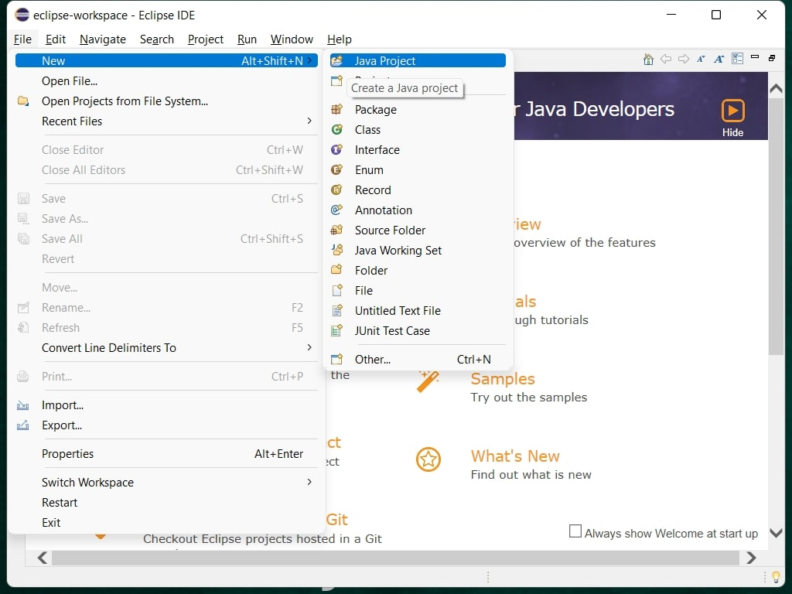

For the project I want to use the default location, use a project specific JRE and don't want
to create `module-info.java` file.
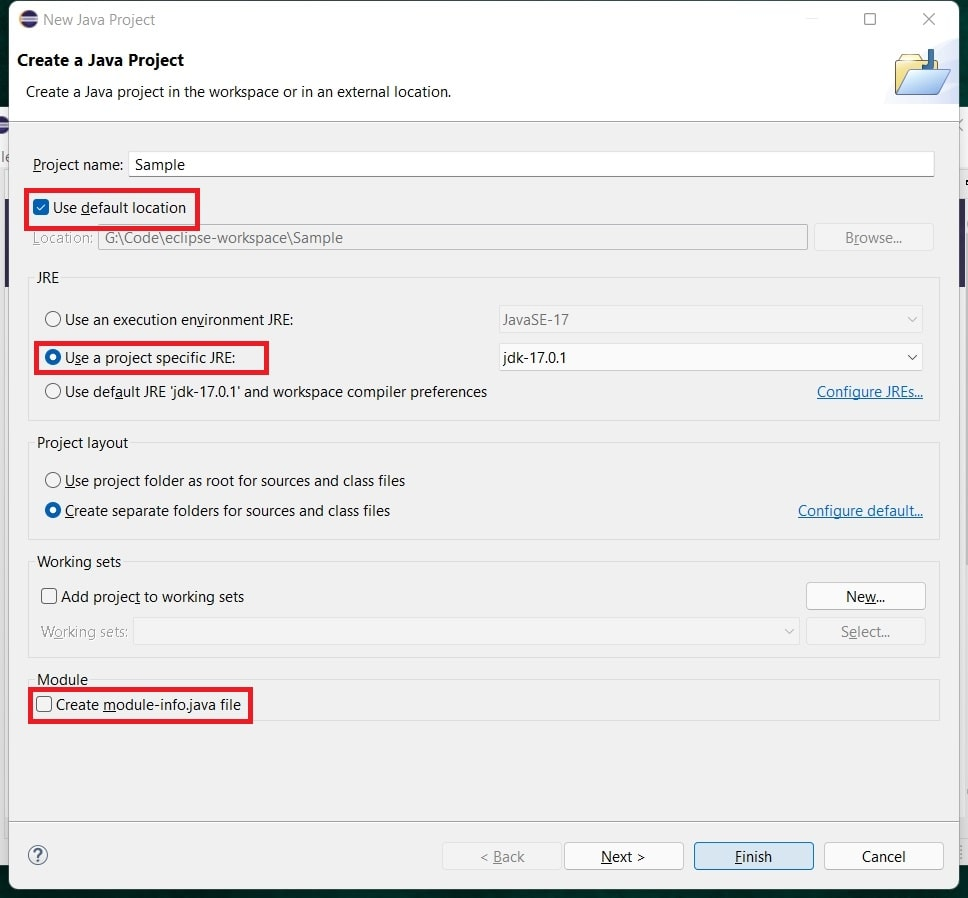

Now, I want to create a `Main` class.
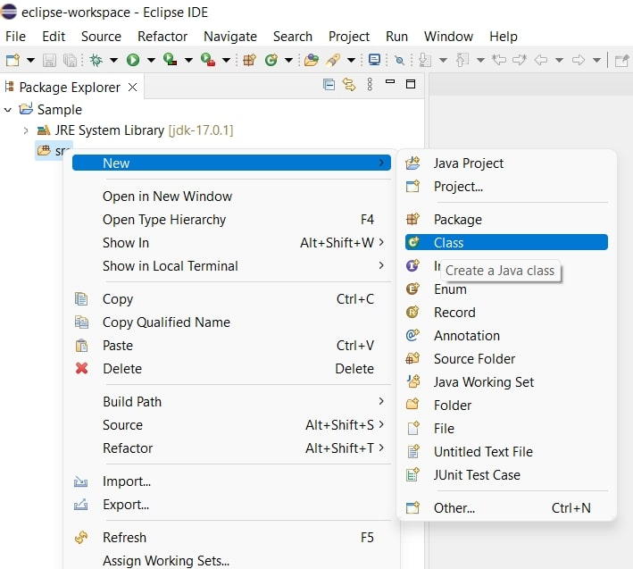

I want to generate a `public static void main` method me.
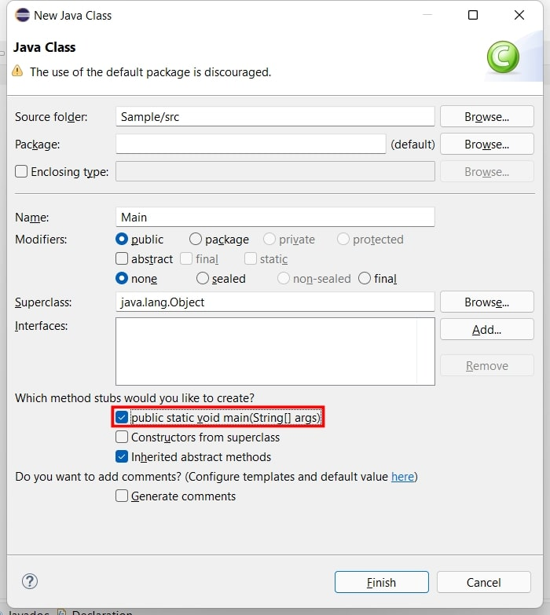

I have added the de facto `Hello World` print. Now, time to run the program.
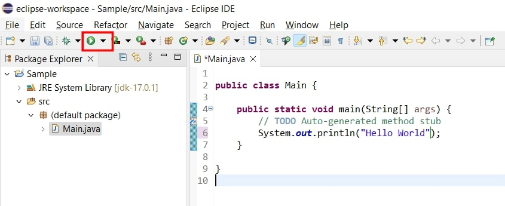

I always prefer to save the files before running the project.
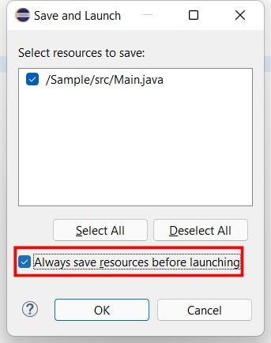

Atlast, out disired output is here
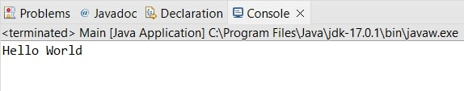

Hope now you have a clear idea how to create a new project.

