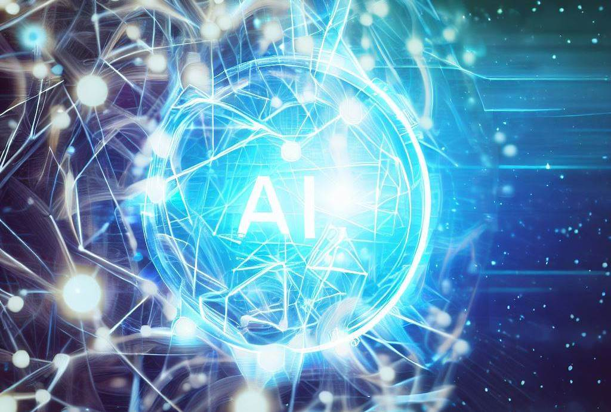

The world we live in is changing. In the past months, we have seen the rise of Artificial Intelligence (AI) and its integration into our everyday lives. This has revolutionized the way we interact with technology, and has had a profound effect on the web. With the emergence of powerful AI tools, the web has become increasingly fake, leading many to feel like the content they are consuming is no longer real.

The feeling of fake content has been creeping up on us for some time now, but it has only become more obvious as AI tools have become more sophisticated. AI tools have made it easier than ever to create content that is indistinguishable from real content, leading to a feeling of unease among web users. This feeling is only going to get worse as AI tools become more powerful and widespread.

Text data has been particularly affected by AI tools. AI-powered tools have made it easier than ever to generate text-based content, making it difficult for traditional content creators to keep up with the competition. This has caused a decrease in the quality of original text-based content, making it seem less real and more fake.

Images have also been affected by AI tools. AI-generated images have become increasingly realistic, making it difficult to distinguish them from real images. This has led to a decrease in the authenticity of original images, and a feeling of not being as organic anymore when surfing the web.

The feeling of inorganic content will only become stronger in the upcoming times as AI tools become more powerful and widespread. AI tools are being used to create content that is indistinguishable from real content, leading to a feeling of unease among web users. We must accept the fact that the web is becoming more fake, and that there is no way around it.

The key to dealing with this issue is to use AI tools productively instead of trying to fight against them. We must learn to use these tools to help us create better content in a shorter amount of time, rather than becoming obsolete. By learning how to use AI tools productively, we can stay ahead of the game and create content that is more engaging and authentic.
